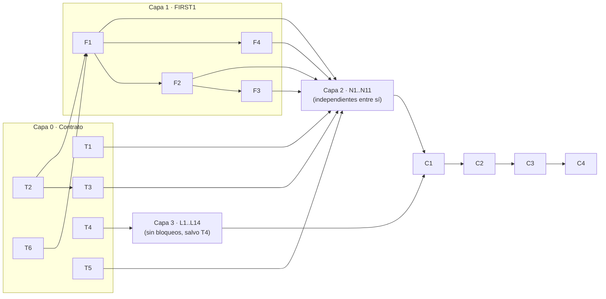

# Roadmap — TPM 1ª Entrega

PDR con recuperación de errores antipánico. Este archivo se genera desde la planilla de
seguimiento; si cambia el plan, se actualizan los dos.

**Planilla de seguimiento:** _(pegar acá el link de Google Sheets)_

---

## Cómo está organizado

El trabajo no se reparte por módulo ni por persona: es una **cola de 39 tickets chicos**
que cualquiera toma. Si un integrante hace 5 y otro hace 25, la entrega sale igual; lo
único que cambia es el reparto.

Tres mecanismos hacen que eso funcione:

1. **Migración de firma en un PR mecánico (T3).** Agregar `folset` a un procedimiento
   rompe la compilación de todos sus llamadores. Si cada ticket agregara su propio
   parámetro, los tickets colisionarían y habría que ordenarlos. `T3` agrega el parámetro
   a los 29 prototipos y a los 29 call sites de una, con un placeholder: no piensa, no
   decide, compila verde. A partir de ahí cada ticket toca **sólo el cuerpo de sus
   funciones**, nunca la firma de otra.

2. **Header de conjuntos pre-poblado (T2).** Mismo truco: los 30 `#define F_*` existen
   desde el principio en placeholder. Cualquier ticket puede referenciar `F_LO_QUE_SEA` y
   compilar aunque nadie lo haya calculado. Cada F-ticket reemplaza sólo el suyo.

3. **`tests/entrega1/pendientes/` como desacoplador.** Los 14 tickets de lotes no dependen
   de una sola línea de código: se pueden escribir el día uno. Cuando un ticket de
   instrumentación hace pasar un lote, lo promueve (`git mv`) en el mismo PR.

La consecuencia es que **ningún ticket de instrumentación bloquea a otro ticket de
instrumentación**. Toda la dependencia del proyecto vive en 10 tickets (Capa 0 y Capa 1).

---

## Qué gramática manda

**La BNFE es la fuente de verdad.** Tres pruebas:

- La BNFE tiene 30 no terminales; `parser.c` tiene 29 funciones. La diferencia es
  exactamente `<relación>`, que es el ítem 6 de la guía práctica. Mapeo 1:1 salvo la
  excepción que la cátedra señala.
- En `<declarador init>`, la BNF pone el `[` **después** del `=`; la BNFE lo pone como
  **alternativa** al `=`. `declarador_init()` hace `case CASIGNAC` y `case CCOR_ABR` como
  ramas hermanas → sigue la BNFE. La BNF está mal ahí.
- La BNF define `<op relacional> ::= = | != | == | < | <= | >= | >`, y `<resto expresión>`
  tiene además una alternativa que arranca con `=`. La BNFE no: `<relación>` no incluye
  `=`. Ver `T6`.

**Para qué sirve entonces la BNF:** la BNFE no le pone nombre al conjunto de terminales
que *continúa* una iteración `{ }`. La BNF sí — `<resto término>`, `<resto expresión
simple>`, `<resto lista expr>`, `<resto prop in>`, `<else opcional>`… Cada uno es la
condición de un `while` o un `if` en `parser.c`, y son justo los conjuntos que necesitás
para el `test` al final de un cuerpo de bucle (consigna 12). La BNF es el **diccionario de
nombres de los conjuntos de continuación**, no una gramática alternativa. Se usa como
andamio de cálculo, verificando cada producción contra la BNFE antes de confiar en ella.

---

## Reglas de operación

Estas reglas son lo que hace que la entrega no dependa de cuánto priorice cada integrante.
Las tareas solas, no.

- **R1.** Un ticket = un issue = una rama feat/<id> = un PR. Nunca dos grupos en un PR.
  _Es la convención que ya está en el README; ahora es obligatoria._
- **R2.** Nadie asigna tickets. Cada uno se auto-asigna de la cola.
  _Elimina la negociación como prerrequisito del trabajo._
- **R3.** Claim con vencimiento: 72 h sin PR abierto y el issue vuelve a la cola. Sin avisar ni preguntar.
  _Convierte 'no priorizó' en un evento automático, no en una conversación incómoda._
- **R4.** Máximo 1 ticket tomado por persona a la vez.
  _Evita que alguien acapare 8 tickets y los congele._
- **R5.** Definition of done = CI verde. No existe 'ya lo hice, falta que revisen'.
  _Saca el juicio humano del camino crítico._
- **R6.** Las decisiones de contrato (T1-T6) se proponen como PR con ventana de 48 h.
  _Nunca 'esperemos a que conteste'._
- **R7.** Si estás bloqueado, tomás un ticket de la Capa 3 (lotes). Siempre hay.
  _Cero tiempo muerto. La Capa 3 no depende de una sola línea de código._
- **R8.** git rebase sobre develop antes de pedir review. Nunca merge commit. Nunca reformatear ni reordenar funciones de parser.c.
  _Los 11 grupos N tocan el mismo archivo en bloques disjuntos: el único riesgo real de conflicto es el formateo._
- **R9.** Los F-tickets son los únicos que tocan el header de conjuntos. Los N-grupos son los únicos que tocan parser.c.
  _Separación de propiedad por archivo entre capas._
- **R10.** Cada F_X se define como unión LITERAL de terminales, jamás en términos de otro F_Y.
  _Hace los 30 #define textualmente independientes: cero conflicto de merge aunque conceptualmente haya orden._

---

## Tickets

### Capa 0 · Contrato

| ID | Ticket | DoD | Prio | Bloqueado por | Bloquea a |
|---|---|---|---|---|---|
| `T1` | Implementar test(c1, c2, ne) | Función compilando + test unitario en tests/unit/. NO se usa todavía en ningún procedimiento. | P0 | — | `N1`, `N2`, `N3`, `N4`, `N5`, `N6`, `N7`, `N8`, `N9`, `N10`, `N11` |
| `T2` | Header de conjuntos con placeholders | Header nuevo con los 30 #define F_* y los conjuntos de continuación en placeholder. ucc compila y se comporta IDÉNTICO a hoy. | P0 | — | `F1`, `F2`, `F3`, `F4`, `T3` |
| `T3` | Migración mecánica de la firma folset | set folset agregado a los 29 prototipos y pasado en los 29 call sites con placeholder. Compila, comportamiento IDÉNTICO, CI verde. | P0 | `T2` | `N1`, `N2`, `N3`, `N4`, `N5`, `N6`, `N7`, `N8`, `N9`, `N10`, `N11` |
| `T4` | Arreglar error_handler() / rama last_call | Un lote válido y uno inválido producen salida limpia y reproducible, corrida tras corrida. | P0 | — | `L5`, `L6`, `L7`, `L8`, `L9`, `L10`, `L11`, `L12`, `L13` |
| `T5` | Fijar el criterio de test inicial vs. test final | Sección en docs/decisiones/entrega1.md, mergeada. Es la referencia que citan los 11 grupos N. | P0 | — | `N1`, `N2`, `N3`, `N4`, `N5`, `N6`, `N7`, `N8`, `N9`, `N10`, `N11` |
| `T6` | Reconciliar BNF y BNFE, fijar fuente de verdad | Entrada en la bitácora con las discrepancias encontradas y la regla de uso de cada notación. | P0 | — | `F1`, `F2`, `F3`, `F4` |

Notas por ticket

- **`T1`** — Consigna 5. Decidir dónde vive (util.c vs parser.c) y justificarlo en la bitácora.
- **`T2`** — Consigna 4. Decisión: qué placeholder deja el comportamiento actual intacto en vez de romperlo. Fijar también la convención de nombres F_* / C_*.
- **`T3`** — Consigna 7. PR puramente mecánico: no piensa, no decide. Es lo que permite que los 11 grupos N sean independientes.
- **`T4`** — En error.c, la rama if(last_call) usa 'int i' sin inicializar. Contamina todo .esperado generado antes del fix.
- **`T5`** — Consigna 6. 3 a 5 reglas, no un mapeo procedimiento por procedimiento. Si cada uno improvisa, el parser se recupera inconsistente.
- **`T6`** — La BNFE es la operativa (30 no terminales, 1:1 con parser.c salvo <relación>). La BNF impresa tiene al menos un error en <declarador init> y un '=' de más en <op relacional>. Insumo directo de guía práctica 2 y 6.

### Capa 1 · FIRST1

| ID | Ticket | DoD | Prio | Bloqueado por | Bloquea a |
|---|---|---|---|---|---|
| `F1` | **Hojas** — Conjuntos de las hojas de la gramática | F_CONSTANTE y F_ESPECIFICADOR_TIPO definidos como unión LITERAL de terminales. | P0 | `T2`, `T6` | `F2`, `F4`, `N2`, `N7`, `N9`, `N10`, `N11` |
| `F2` | **Expresiones** — Conjuntos de la región de expresiones | F_EXPRESION, F_EXPRESION_SIMPLE, F_TERMINO, F_FACTOR, F_VARIABLE, F_LLAMADA_FUNCION, F_LISTA_EXPRESIONES, F_RELACION + los conjuntos de continuación de sus iteraciones. | P0 | `F1`, `T2`, `T6` | `F3`, `N1`, `N2`, `N3`, `N5`, `N6` |
| `F3` | **Proposiciones** — Conjuntos de la región de proposiciones | F_PROPOSICION, F_LISTA_PROPOSICIONES, F_PROPOSICION_COMPUESTA, _ITERACION, _SELECCION, _E_S, _RETORNO, _EXPRESION + conjuntos de continuación. | P0 | `F2`, `T2`, `T6` | `N4`, `N5`, `N8` |
| `F4` | **Declaraciones** — Conjuntos de la región de declaraciones | F_UNIDAD_TRADUCCION, F_DECLARACIONES, F_ESPECIFICADOR_DECLARACION, F_DEFINICION_FUNCION, F_DECLARACION_VARIABLE, F_LISTA_DECLARACIONES_PARAM, F_DECLARACION_PARAMETRO, F_DECLARADOR_INIT, F_LISTA_DECLARACIONES_INIT, F_LISTA_INICIALIZADORES, F_LISTA_DECLARACIONES, F_DECLARACION + continuaciones. | P0 | `F1`, `T2`, `T6` | `N4`, `N7`, `N8`, `N9`, `N10`, `N11` |

Notas por ticket

- **`F1`** — Consigna 3. El ticket más chico y el segundo más apalancado: destraba F2, F4 y 5 grupos N.
- **`F2`** — Continuaciones (nombres de la BNF): resto expresión, resto expresión simple, resto término, resto opcional (subíndice), resto lista expr, operador opcional. Los 7 no terminales forman una componente fuertemente conexa: por eso van en un solo ticket.
- **`F3`** — Continuaciones: lista proposición, else opcional, resto prop in (>>), resto prop out (<<).
- **`F4`** — Continuaciones: unidad traducción, resto lista decl par, resto lista decl init, resto lista inic, lista declaración, opref opcional (&), arreglo opcional ([ ]), límite opcional, lista opcional. F2 y F4 son paralelos: no se necesitan mutuamente.

### Capa 2 · Instrumentación

| ID | Ticket | DoD | Prio | Bloqueado por | Bloquea a |
|---|---|---|---|---|---|
| `N1` | **Núcleo de expresión** — Instrumentar expresion, expresion_simple, termino | CI verde. Lotes de pendientes/ que ahora pasan, promovidos en el mismo PR. | P0 | `F2`, `T1`, `T3`, `T5` | `C1` |
| `N2` | **Hojas de expresión** — Instrumentar factor, constante | CI verde. Lotes promovidos. | P0 | `F1`, `F2`, `T1`, `T3`, `T5` | `C1` |
| `N3` | **Referencias** — Instrumentar variable, llamada_funcion, lista_expresiones | CI verde. Lotes promovidos. | P1 | `F2`, `T1`, `T3`, `T5` | `C1` |
| `N4` | **Bloque** — Instrumentar proposicion_compuesta, lista_proposiciones, proposicion | CI verde. Lotes promovidos. | P0 | `F3`, `F4`, `T1`, `T3`, `T5` | `C1` |
| `N5` | **Control** — Instrumentar proposicion_iteracion, proposicion_seleccion | CI verde. Lotes promovidos. | P1 | `F2`, `F3`, `T1`, `T3`, `T5` | `C1` |
| `N6` | **E/S, retorno y expresión** — Instrumentar proposicion_e_s, proposicion_retorno, proposicion_expresion | CI verde. Lotes promovidos. | P1 | `F2`, `T1`, `T3`, `T5` | `C1` |
| `N7` | **Raíz** — Instrumentar unidad_traduccion, declaraciones, especificador_tipo | CI verde. Lotes promovidos. | P0 | `F1`, `F4`, `T1`, `T3`, `T5` | `C1` |
| `N8` | **Bifurcación de declaración** — Instrumentar especificador_declaracion, definicion_funcion | CI verde. Lotes promovidos. | P0 | `F3`, `F4`, `T1`, `T3`, `T5` | `C1` |
| `N9` | **Parámetros** — Instrumentar lista_declaraciones_param, declaracion_parametro | CI verde. Lotes promovidos. | P2 | `F1`, `F4`, `T1`, `T3`, `T5` | `C1` |
| `N10` | **Variables e init** — Instrumentar declaracion_variable, lista_declaraciones_init, declarador_init | CI verde. Lotes promovidos. | P1 | `F1`, `F4`, `T1`, `T3`, `T5` | `C1` |
| `N11` | **Inicializadores y declaración local** — Instrumentar lista_inicializadores, lista_declaraciones, declaracion | CI verde. Lotes promovidos. | P1 | `F1`, `F4`, `T1`, `T3`, `T5` | `C1` |

Notas por ticket

- **`N1`** — Guía práctica 6: por qué <relación> no tiene función en el parser.
- **`N2`** — NO tocar el hack lexema[0]=='f' en factor(): depende de la Tabla de Símbolos (entrega 2). Anotarlo en la bitácora y seguir.
- **`N3`** — Consigna 12: bucle con ',' en lista_expresiones.
- **`N4`** — El grupo con más folsets cruzados. Es el último eslabón del camino crítico.
- **`N5`** — Ojo el else opcional: su conjunto de continuación es {else}.
- **`N6`** — Guía práctica 7: por qué proposicion_retorno arranca con scanner(). Consigna 10 aplica acá. Consigna 12 con >> y <<.
- **`N7`** — Acá vive el error 'al inicio del programa'. Es el primer test que ve cualquier lote.
- **`N8`** — Guía práctica 8: por qué CPYCOMA es alternativa válida antes de declaracion_variable().
- **`N9`** — Guía práctica 9: por qué declaracion_parametro no está escrita de la forma 'obvia'. Consigna 12 con ','.
- **`N10`** — declarador_init es la producción donde la BNF y la BNFE se contradicen. Seguir la BNFE (ver T6).
- **`N11`** — Consigna 12 con ',' en lista_inicializadores.

### Capa 3 · Lotes

| ID | Ticket | DoD | Prio | Bloqueado por | Bloquea a |
|---|---|---|---|---|---|
| `L1` | **Válidos** — 3 lotes válidos: declaraciones globales, arreglos con inicializador, parámetros por referencia | 3 archivos en tests/entrega1/pendientes/validos/ con cabecera de expectativa. | P0 | — | — |
| `L2` | **Válidos** — 3 lotes válidos: while, if/else, anidamiento de proposiciones compuestas | 3 archivos en pendientes/validos/ con cabecera de expectativa. | P0 | — | — |
| `L3` | **Válidos** — 3 lotes válidos: precedencia de operadores, cin/cout encadenados, llamada a función | 3 archivos en pendientes/validos/ con cabecera de expectativa. | P0 | — | — |
| `L4` | **Válidos** — 1 lote válido 'programa realista' que atraviese toda la gramática | 1 archivo en pendientes/validos/. | P0 | — | `C1` |
| `L5` | **Inválidos** — Lote inválido: falta ';' | Lote + .esperado generado copiando la salida real de ucc. | P0 | `T4` | — |
| `L6` | **Inválidos** — Lote inválido: falta ',' | Lote + .esperado generado de una corrida real. | P0 | `T4` | — |
| `L7` | **Inválidos** — Lote inválido: falta ')' | Lote + .esperado generado de una corrida real. | P1 | `T4` | — |
| `L8` | **Inválidos** — Lote inválido: falta '}' | Lote + .esperado generado de una corrida real. | P1 | `T4` | — |
| `L9` | **Inválidos** — Lote inválido: especificador de tipo inválido | Lote + .esperado generado de una corrida real. | P1 | `T4` | — |
| `L10` | **Inválidos** — Lote inválido: falta identificador | Lote + .esperado generado de una corrida real. | P1 | `T4` | — |
| `L11` | **Inválidos** — Lote inválido: símbolo inesperado al inicio de proposición | Lote + .esperado generado de una corrida real. | P1 | `T4` | — |
| `L12` | **Inválidos** — Lote inválido: error dentro de una expresión | Lote + .esperado generado de una corrida real. | P1 | `T4` | — |
| `L13` | **Inválidos** — 2 lotes con errores en cascada | 2 lotes + .esperado: varios errores en la misma línea y en líneas sucesivas. | P0 | `T4` | `C1` |
| `L14` | **Proceso** — Cabecera de expectativa en todos los lotes | Todo lote tiene un comentario inicial diciendo qué debe reportar ucc, escrito ANTES de correrlo. | P1 | — | — |

Notas por ticket

- **`L1`** — Guía práctica 3.
- **`L2`** — Guía práctica 3.
- **`L3`** — factor() hoy bifurca por lexema[0]=='f'. Nombrá las funciones empezando con 'f' o vas a testear el hack, no la gramática.
- **`L4`** — Es el canario de regresión de toda la entrega.
- **`L5`** — Nunca tipear el .esperado: error_print deja espacios finales antes del \n.
- **`L6`** — Consigna 12: el caso canónico.
- **`L8`** — El más duro para el antipánico: sincroniza contra el fin del bloque.
- **`L13`** — Consignas 13 y 14: es lo único que mide de verdad la reconfiguración.
- **`L14`** — Sin esto un lote no es un test, es una anécdota.

### Capa 5 · Cierre

| ID | Ticket | DoD | Prio | Bloqueado por | Bloquea a |
|---|---|---|---|---|---|
| `C1` | Curar docs/decisiones/entrega1.md desde la bitácora | Documento completo con decisiones y justificación, incluidos los casos de reconfiguración extra. | P0 | `L4`, `L13`, `N1`, `N2`, `N3`, `N4`, `N5`, `N6`, `N7`, `N8`, `N9`, `N10`, `N11` | `C2` |
| `C2` | Empaquetar la entrega | scripts/empaquetar.sh 1 corre y el zip contiene ucc + fuentes + decisiones. | P0 | `C1` | `C3` |
| `C3` | PR develop -> main y tag entrega1 | PR aprobado por los otros dos + tag entrega1 en main. | P0 | `C2` | `C4` |
| `C4` | Subir a Classroom | Entrega cargada antes de la fecha del cronograma. | P0 | `C3` | — |

Notas por ticket

- **`C1`** — Guía general 2: la cátedra corrige contra esto.

---

## Grafo de dependencias

### Peso de bloqueo

Cuántos tickets destraba cada uno (sólo los que destraban algo):

| Ticket | Destraba | Lectura |
|---|---|---|
| `T1` | 11 | Sin `test()` no hay recuperación en ningún lado. |
| `T3` | 11 | Lo más caro de postergar y lo que menos piensa. Va primero. |
| `T5` | 11 | Lo más caro de hacer **mal**: si cada uno improvisa el criterio, hay que reabrir los 29 procedimientos. |
| `T4` | 9 | No está en el camino crítico, pero todo `.esperado` generado antes del fix queda inválido. |
| `F1` | 7 | El ticket más chico y el segundo más apalancado. |
| `F2` | 6 | Los 7 no terminales son una componente fuertemente conexa: no se pueden partir. |
| `F4` | 6 | El F de mayor rendimiento directo. |
| `T2` | 5 | Mecánico. Habilita T3 y las cuatro F. |
| `T6` | 4 | Barato. Evita que alguien calcule FIRST desde la BNF y choque con un error de la cátedra. |
| `F3` | 3 | Último eslabón de la cadena de conjuntos. |

**Camino crítico:** `T2 → F1 → F2 → F3 → N4 → C1 → C2 → C3 → C4` — 9 nodos, 8 saltos.
Todos los eslabones hasta `N4` son de Capa 0 y Capa 1: **10 tickets controlan el
cronograma entero**.

### Frente de trabajo

| Cuando está Hecho | Tickets disponibles |
|---|---|
| nada todavía | 10 (`T1` `T2` `T4` `T5` `T6` + `L1`–`L4` `L14`) |
| `T1` `T3` `T5` `F1` `F4` | + `N7` `N9` `N10` `N11` |
| … + `F2` | + `N1` `N2` `N3` `N6` → **9 de 11 grupos abiertos** |
| … + `F3` | los 11 |

Con seis tickets (`T2`, `T3`, `T1`, `T5`, `F1`, `F4`) ya hay ~19 tareas simultáneas en la
cola. Ese es el número que importa: mientras haya 19 tickets libres, que alguien no
aparezca no frena a nadie.

---

## Riesgo residual

Los 11 grupos de Capa 2 tocan el mismo archivo (`parser.c`), en bloques de funciones
disjuntos. El único riesgo real de conflicto es el formateo: ver regla **R8**.
